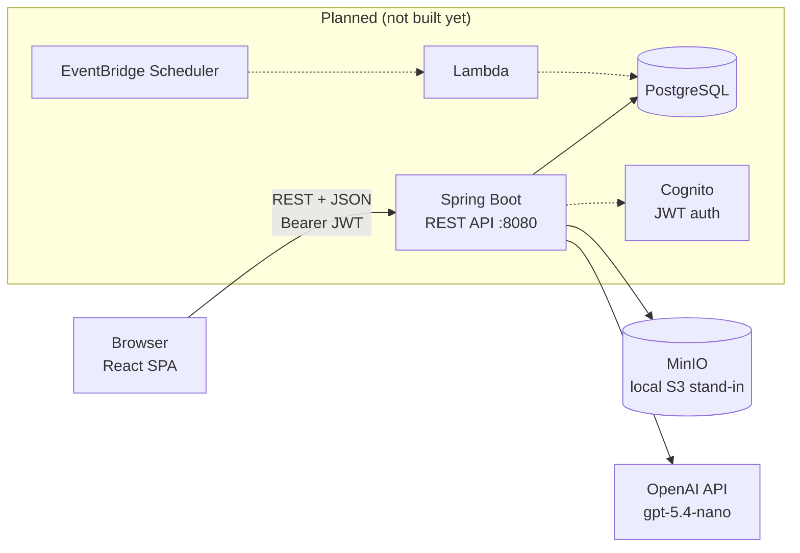
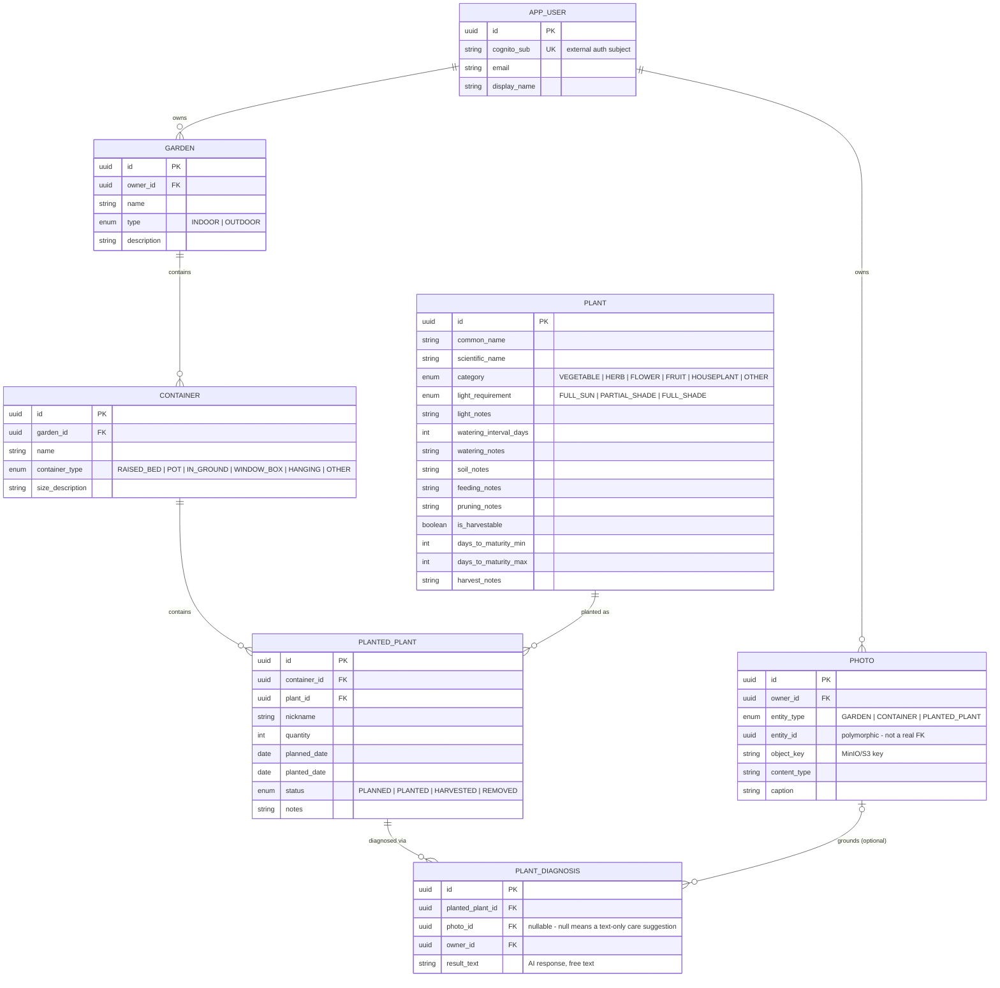

# Architecture

System design reference for GreenThumb. For stack-specific implementation conventions, see
[`backend/CLAUDE.md`](../../backend/CLAUDE.md) and [`frontend/CLAUDE.md`](../../frontend/CLAUDE.md).
For REST conventions, see [`api-conventions.md`](api-conventions.md).

## System overview

Locally: the frontend (`:5173`) talks directly to the backend (`:8080`), which talks to a plain
Postgres container, a MinIO container (photo storage, S3-compatible), and the OpenAI API
directly (photo identification/diagnosis, garden planning). In the cloud (planned): React build
served from S3 + CloudFront, backend runs on App Runner, database is Aurora PostgreSQL Serverless
(scale-to-zero), MinIO is replaced by real S3, and the OpenAI API call is replaced by Bedrock
IAM-role auth behind the same `AiClient` interface. See the "Infrastructure" section below for the
full planned topology and why each piece was chosen.

## Data model

**Design decisions worth knowing:**

- **`Plant` is a shared, seeded catalog**, not owned by any one user (26 plants seeded across
  vegetables/herbs/fruit/flowers/houseplants in `V6__seed_plants.sql`). There's no user-submitted
  plant support yet — that was a deliberate MVP scope cut (see `Status` in the root `CLAUDE.md`).
- **Care guide fields are a hybrid of structured + free-text** per category (e.g.
  `light_requirement` enum + `light_notes` text; `watering_interval_days` int + `watering_notes`
  text). The structured half exists specifically so a future calendar/scheduling feature can compute
  due dates without re-parsing prose. The harvest guide (`is_harvestable`, `days_to_maturity_*`,
  `harvest_notes`) follows the same pattern.
- **Ownership lives only on `Garden` (`owner_id`)** - `Container` and `PlantedPlant` don't have
  their own owner column. Ownership for nested resources is enforced by traversing the relationship
  in the repository query itself (e.g. `findByIdAndGarden_Owner_Id`), not by denormalizing an
  `owner_id` onto every table. See `backend/CLAUDE.md` for the concrete pattern.
- **`PlantedPlant.status` is the source of truth for `planted_date`**: a DB check constraint
  requires `planted_date` once `status` moves past `PLANNED`. This is what lets a "plan" (not yet
  in the ground) and an "actual planting" share one table instead of two.
- **All enums are stored as `VARCHAR` with a `CHECK` constraint**, not native Postgres enum types or
  integer codes - keeps adding a new enum value a pure additive migration.
- **`Photo` is polymorphic** (`entity_type` + `entity_id`, covering `Garden`, `Container`, and
  `PlantedPlant`) rather than three separate photo tables. Like `PlantedPlant.owner`, `owner_id` is
  denormalized directly onto the row - `entity_id` can't be a real FK since it points at three
  different tables, so ownership can't be derived through a join the way it is for `Container`
  (via `Garden`).
- **`PlantDiagnosis` covers both photo-based diagnosis and text-only care suggestions** with one
  table - a care suggestion is just a diagnosis row with `photo_id` null. The AI's response is
  stored as an unstructured text blob (`result_text`), not parsed into structured fields - a
  deliberate MVP scope cut, same spirit as the free-text halves of the `Plant` care-guide fields.

Plant identification (photo → best-guess species, to help a user add an unknown plant) is
deliberately **not persisted** - it's a one-off aid for picking what to add via the existing
add-to-garden/container/inventory flow, not a record tied to any entity.

## Backend architecture

Spring Boot, package-by-domain (`user`, `garden`, `container`, `plant`, `planting`, `photo`, `ai`,
`diagnosis`, `common`), each following the same entity → repository → service → controller shape.
REST API under `/api/v1`. Full conventions, the ownership-enforcement pattern, and the
module-adding playbook live in [`backend/CLAUDE.md`](../../backend/CLAUDE.md) - read that before
touching backend code.

`photo`'s `StorageService` interface and `ai`'s `AiClient` interface are the two provider seams:
`MinioStorageService`/`OpenAiClient` are the local-dev implementations, swapped for
S3/Bedrock-backed implementations later without touching any caller. Both are excluded from the
`test` Spring profile (see `backend/CLAUDE.md` → Testing) in favor of in-memory/canned fakes, so
the test suite never needs a live MinIO container or the real OpenAI API.

Auth is currently a **dev-only stub** (`X-Dev-User-Id` header → auto-provisioned `AppUser`), not
real Cognito JWT validation. See the root `CLAUDE.md` for why and what changes when Cognito exists.

## Frontend architecture

React + TypeScript + Vite, organized by feature (`features/{gardens,containers,plants,plantings}`),
each with an `api.ts` (React Query hooks) and page/dialog components. Full conventions and the
feature-adding playbook live in [`frontend/CLAUDE.md`](../../frontend/CLAUDE.md).

## Infrastructure (planned, not built yet)

| Piece | Choice | Why |
|---|---|---|
| Compute | AWS App Runner (container from ECR) | No ALB/VPC-ingress cost; idle cost ~$2-4/mo |
| Database | Aurora PostgreSQL, Serverless scale-to-zero | Near-$0 compute cost while idle |
| Auth | Amazon Cognito (Lite tier) | Free at hobby scale (10K MAU free tier) |
| Static hosting | S3 + CloudFront | Pennies at this scale |
| Photo storage | S3 (MinIO container locally) | Pennies at this scale; `StorageService` already speaks the S3 API |
| IaC | Terraform | Broad ecosystem support for infra touched infrequently |
| CI/CD | GitHub Actions | Free at this scale |

**Cost guardrail:** never add a NAT Gateway - at ~$32/month it would roughly triple the whole
project's AWS bill. App Runner's VPC Connector reaches Aurora privately without one; a future
Bedrock/S3 call from inside the VPC should use VPC endpoints instead of a NAT Gateway too.

**Planned calendar/reminders feature:** a `CareTask` entity (FK to `PlantedPlant` only, purely
additive) generated by EventBridge Scheduler → Lambda → RDS Data API, kept deliberately outside
App Runner's request/response path so it doesn't defeat Aurora's scale-to-zero by polling
constantly.

**AI features (built, local-dev stand-in):** the `ai` backend package's `AiClient` interface
covers plant identification, photo-based diagnosis, care suggestions, and a garden planning
assistant. It's currently implemented by `OpenAiClient`, calling the OpenAI API directly
with an API key (model `gpt-5.4-nano`, chosen for near-$0 cost at hobby scale) - the original
plan of calling Amazon Bedrock via IAM role auth (no API key to manage) is the **planned**
production implementation once the app deploys, as a second `AiClient` implementation behind the
same interface. Photo storage follows the same pattern: `StorageService` is implemented by
`MinioStorageService` locally (MinIO container in `docker-compose.yml`, S3-compatible SDK calls
with an endpoint override) and swaps to real S3 + IAM auth the same way.
